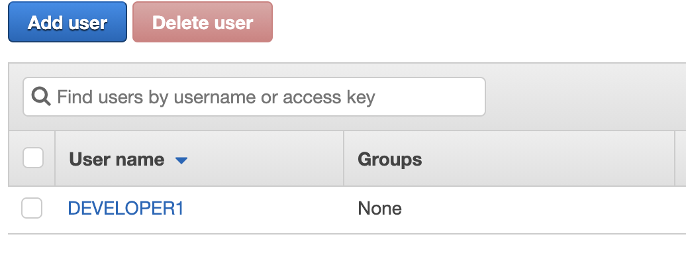
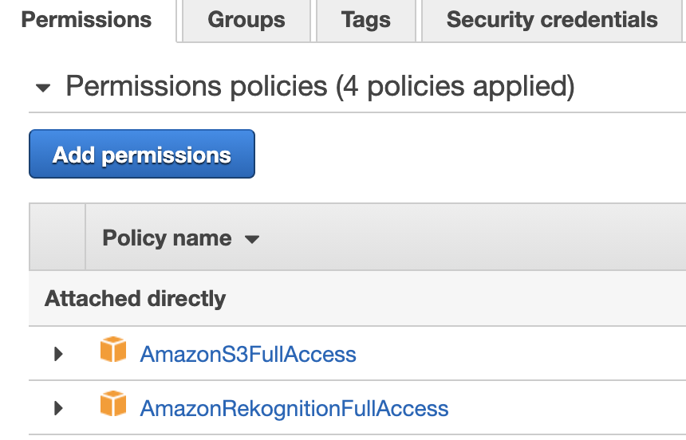
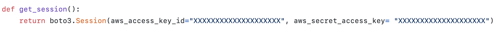
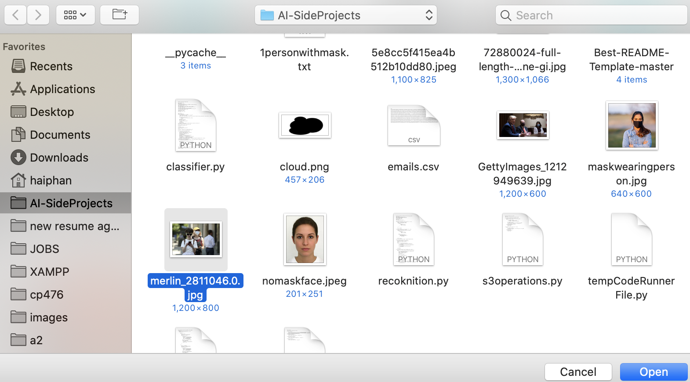
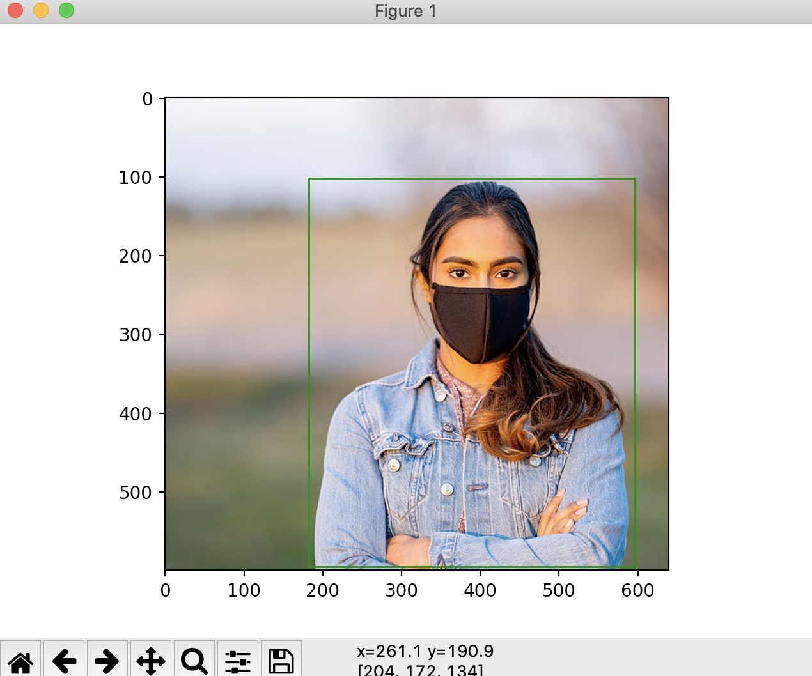
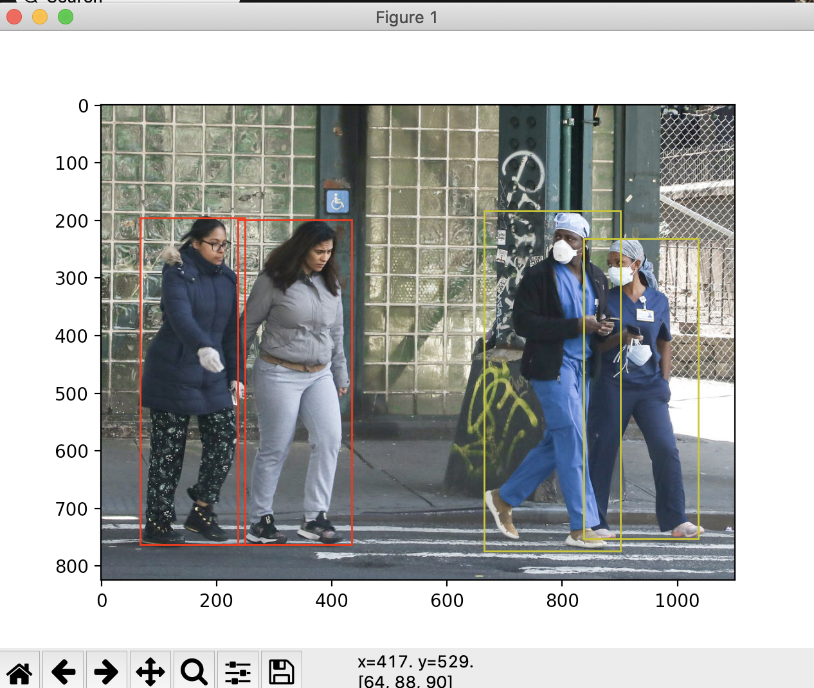

[![Issues][issues-shield]][issues-url]
[![APACHE License][license-shield]][license-url]
[![LinkedIn][linkedin-shield]][linkedin-url]

<!-- PROJECT LOGO -->
 

  

  <h3 align="center">PPE Detection Software</h3>
  <h4 align="center"><i>Currently in Pre-Alpha</i></h4>

<!-- TABLE OF CONTENTS -->

  
<h2 style="display: inline-block">Table of Contents</h2>

  <ol>
    <li>
      <a href="#about-the-project">About The Project</a>
      <ul>
        <li><a href="#built-with">Built With</a></li>
      </ul>
    </li>
    <li>
      <a href="#getting-started">Getting Started</a>
      <ul>
        <li><a href="#prerequisites">Set up your AWS User</a></li>
      </ul>
    </li>
    <li><a href="#usage">Usage</a></li>
    <li><a href="#license">License</a></li>
    <li><a href="#contact">Contact</a></li>
    <li><a href="#acknowledgements">Acknowledgements</a></li>
  </ol>

<!-- ABOUT THE PROJECT -->
## About The Project

PPE Detector provides a cheap and easy-to-install solution for organizations to enforce their mask-wearing policy. PPE Detector accepts a photo as an input, then calculate whether everyone in the photos are wearing proper facial protection.

### Built With

* AWS S3 Simple Storage Service
* AWS Rekognition 
* Python

### Requirement

* The software is currently designed to work on MacOS only due different in Python packages between Windows and MacOS verions of Python. Particularly, User Interface packages available for Windows are not available for MacOS. However, aside from UI, the other functions are exactly the same between MacOS and Window.
Therefore, I have given this program a complete open-source license in order to encourage aspiring developers to contribute to it. <u>You are fully authorized to obtain a copy, modify and redistribute this program and its derivatives. Please see </u>Please see [LICENSE](LICENSE.txt) for full details.

<!-- GETTING STARTED -->
## Getting Started
### Setting up your AWS User

To use this software, you need to own an AWS account.    
First, set up a new User in your IAM system. Don't forget to save your credentials.
    
Then, add AmazonS3FullAccess and AmazonRekognitionFullAccess policies to the user  
    

Finally, enter your AWS User credentials into `utils.py`. Replace the "XXXX" sections with your credentials.
     

<!-- USAGE EXAMPLES -->
## Usage
Since the program is still in pre-alpha development, a developer environment is required to execute. In this demo, I will be using Visual Studio Code.
After establishing the connection, you can run the program with the following step:  
1. Run [recoknition.py](recoknition.py)
2. A selection should pop up, allowing you to choose an image.
    
3. If the person in the picture is wearing mask, a green square will mark them.
    
4. If not, the square will be red. And if the software cannot detect, it will be yellow.
    

<!-- LICENSE -->
## License

Distributed under the Apache License 2.0. See [`LICENSE`](license-url) for more information.

<!-- CONTACT -->
## Contact

Hai Thanh Phan
Email - phan8640@mylaurier.ca  
LinkedIn - https://www.linkedin.com/in/bryan-hai-thanh-phan/
<!-- ACKNOWLEDGEMENTS -->
## Acknowledgements

* Thank you Othneil Drew for [this README template](https://github.com/othneildrew/Best-README-Template/blob/master/README.md)

<!-- MARKDOWN LINKS & IMAGES -->
<!-- https://www.markdownguide.org/basic-syntax/#reference-style-links -->

[issues-shield]: https://img.shields.io/github/issues/bryanhaiphanthanh/PPE-Detection.svg?style=for-the-badge
[issues-url]: https://github.com/bryanhaiphanthanh/PPE-Detection/issues
[license-shield]: https://img.shields.io/github/license/bryanhaiphanthanh/PPE-Detection.svg?style=for-the-badge
[license-url]: https://github.com/bryanhaiphanthanh/PPE-Detection/blob/main/LICENSE.txt
[linkedin-shield]: https://img.shields.io/badge/-LinkedIn-black.svg?style=for-the-badge&logo=linkedin&colorB=555
[linkedin-url]: https://www.linkedin.com/in/bryan-hai-thanh-phan/
